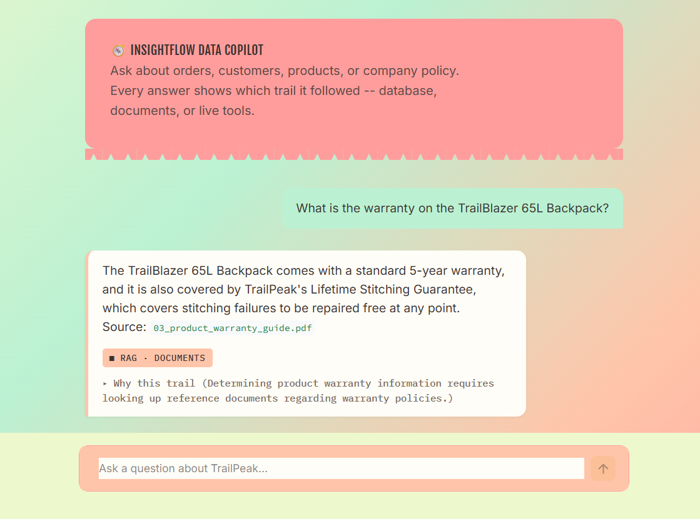

# InsightFlow Data Copilot

**Data & Knowledge Copilot**

[](https://github.com/Mahreen17/InsightFlow-Data-Copilot)
[](./LICENSE)
[](https://www.python.org/downloads/)
[](https://github.com/Mahreen17/InsightFlow-Data-Copilot)
[](https://insightflow-data-copilot.streamlit.app/)

InsightFlow AI is an intelligent data and knowledge assistant that transforms how you interact with information. Ask questions in plain English and receive instant, contextual answers—no SQL queries or manual document searches required. Built on cutting-edge agentic AI architecture, it seamlessly bridges natural language, structured databases, and unstructured knowledge.

*Ask about orders, customers, products, or company policy. Every answer shows which trail it followed — database, documents, or live tools.*

---

## Quick Links

- **[Live Demo](https://insightflow-data-copilot.streamlit.app/)** - Try InsightFlow AI online right now
- **[View on GitHub](https://github.com/Mahreen17/InsightFlow-Data-Copilot)** - Star the repo if you find it useful
- **[Report an Issue](https://github.com/Mahreen17/InsightFlow-Data-Copilot/issues)** - Found a bug? Let us know
- **[Start a Discussion](https://github.com/Mahreen17/InsightFlow-Data-Copilot/discussions)** - Share ideas and ask questions
- **[Get Your Gemini API Key](https://aistudio.google.com/app/apikey)** - Required for first-time setup
- **[Application demo video](https://drive.google.com/file/d/136lBpBk9jbv-vm4YLs9YyQDpNGAABdoM/view?usp=sharing)** - A quick look at the project, its features, and how it works.

---

## Visual Overview



The clean, intuitive interface allows you to interact with your data and documents through natural conversation. No SQL knowledge, database schemas, or API calls required—just ask your question in plain English.

---

## Try the Live Demo

Experience InsightFlow AI without any installation:

**[Launch Live Demo](https://insightflow-data-copilot.streamlit.app/)** — Click to interact with the application right now in your browser.

The live demo showcases the full capabilities of InsightFlow AI including natural-language queries, multi-agent routing, and source attribution.

---

## Overview

InsightFlow AI combines generative AI, multi-agent systems, natural language-to-SQL conversion, retrieval-augmented generation (RAG), vector search, and enterprise tool integration into a unified, conversational interface. Whether you're analyzing customer data, retrieving compliance information, or discovering insights across multiple sources, InsightFlow acts as your intelligent data companion.

The system is architected around specialized AI agents that work in concert: a routing orchestrator determines intent, the SQL agent handles database queries, the RAG agent navigates knowledge bases, and the MCP agent provides structured tool access. Google Gemini powers the natural-language understanding and reasoning at every step.

---

## Key Features

- **Natural-Language Data Queries**: Ask "How many customers do we have?" or "Which product has the highest sales?" and receive instant SQL-generated answers without writing code.

- **Knowledge Base Question Answering**: Pose questions about documents and knowledge bases. The RAG Agent retrieves relevant information using semantic search and synthesizes grounded responses.

- **Multi-Agent Architecture**: An intelligent orchestrator routes requests to the most appropriate specialized agent—SQL, RAG, or tool-based—ensuring precise, efficient handling of every query type.

- **Source Attribution & Transparency**: Every answer includes a clear "trail"—database queries, document sources, or external tools used—so you always know where information came from.

- **No Setup Friction**: Local deployment via Streamlit means no complex infrastructure. Launch in minutes and start querying immediately.

- **Extensible Design**: Built for modularity. Add new agents, data sources, or tool integrations without overhauling the core system.

---

## Architecture

### System Components

**Orchestrator**  
The central decision-making component that analyzes user intent and routes requests to the appropriate specialized agent. Determines whether a query requires database access, knowledge retrieval, or external tool interaction.

**SQL Agent**  
Interprets natural-language questions about structured data, generates appropriate SQL queries, executes them against SQLite, and presents results in clear, human-readable language.

**RAG Agent**  
Handles knowledge-based queries by performing semantic retrieval over vectorized documents stored in ChromaDB. Provides retrieved context to Gemini for generating grounded, source-backed answers.

**MCP Agent**  
Provides structured access to external tools and capabilities, allowing the AI system to interact with APIs and services beyond the core data layer.

**Core Technologies**

- **Google Gemini**: Large language model providing natural-language understanding, reasoning, SQL generation, and response synthesis
- **SQLite**: Lightweight relational database for structured data storage and querying
- **ChromaDB**: Vector database for semantic search and RAG workflows
- **Streamlit**: Interactive Python framework for the user-facing application
- **Python**: Core application language

---

## Installation

### Prerequisites

- Python 3.10 or higher
- pip (Python package manager)
- Internet connection (for Google Gemini API access)
- Google Gemini API key

### Quick Start

1. **Clone the repository**
   ```bash
   git clone https://github.com/Mahreen17/InsightFlow-Data-Copilot.git
   cd InsightFlow-Data-Copilot
   ```
   
   Or visit the [repository on GitHub](https://github.com/Mahreen17/InsightFlow-Data-Copilot).

2. **Create a virtual environment**
   ```bash
   python -m venv venv
   source venv/bin/activate  # On Windows: venv\Scripts\activate
   ```

3. **Install dependencies**
   ```bash
   pip install -r requirements.txt
   ```

4. **Configure your API key**
   
   Create a `.env.local` file in the project root:
   ```
   GEMINI_API_KEY=your_api_key_here
   ```
   
   Get your API key from [Google AI Studio](https://aistudio.google.com/app/apikey). Never commit `.env.local` to version control. Add it to `.gitignore` if not already present.

5. **Run the application**
   ```bash
   streamlit run streamlit_app.py
   ```
   
   The application will open in your browser at `http://localhost:8501`.

---

## Usage

### Natural-Language Data Analysis

Ask InsightFlow about your structured data using conversational language:

- "How many customers do we have?"
- "Which product generated the most revenue this quarter?"
- "Show me the top 5 customers by order count."

The SQL Agent interprets your question, generates an optimized query, executes it, and returns a clear, contextual answer.

### Document & Knowledge Base Queries

Pose questions about documents in your knowledge base:

- "What is our return policy?"
- "Explain the warranty coverage for Product X."
- "Summarize the key compliance requirements in Section 3."

The RAG Agent retrieves relevant documents, performs semantic matching, and uses Gemini to synthesize answers grounded in source material.

### Complex Multi-Step Requests

For queries requiring tool integration or multi-agent coordination, the Orchestrator breaks down your request, delegates to appropriate agents, and synthesizes the complete answer.

---

## Project Structure

```
InsightFlow-Data-Copilot/
├── streamlit_app.py          # Main Streamlit application
├── agents/                   # Agent implementations
│   ├── orchestrator.py       # Request routing and intent analysis
│   ├── sql_agent.py          # Natural-language to SQL conversion
│   ├── rag_agent.py          # Knowledge base retrieval and synthesis
│   └── mcp_agent.py          # External tool integration
├── database/                 # Database and vector store management
│   ├── sqlite_manager.py     # SQLite operations
│   └── chroma_manager.py     # ChromaDB operations
├── utils/                    # Shared utilities
│   ├── config.py             # Configuration and environment handling
│   └── logger.py             # Logging utilities
├── requirements.txt          # Python dependencies
├── .env.local                # API keys (not committed to version control)
└── README.md                 # This file
```

---

## Configuration

All configuration is managed through environment variables defined in `.env.local`:

```
GEMINI_API_KEY=your_gemini_api_key
```

Additional optional configurations:

```
SQLITE_DB_PATH=./data/database.db
CHROMA_PERSIST_DIR=./data/chroma
LOG_LEVEL=INFO
```

---

## Development & Contributing

We welcome contributions from developers and researchers interested in agentic AI systems, LLM applications, and data-driven architectures.

### How to Contribute

1. **Fork the repository** and create a feature branch
   ```bash
   git checkout -b feature/your-feature-name
   ```

2. **Make your changes** with clear, descriptive commits

3. **Test your changes** thoroughly, especially for agent routing and response accuracy

4. **Submit a pull request** with a detailed description of your changes and why they improve the project

### Areas for Contribution

- Enhanced SQL generation and query optimization
- Improved RAG retrieval and answer synthesis
- New agent types (reporting agent, predictive agent, etc.)
- Better error handling and edge case management
- Performance optimization
- Documentation and usage examples

### Development Guidelines

- Follow PEP 8 style guidelines
- Add docstrings to all functions and classes
- Include type hints where applicable
- Write unit tests for new agent logic
- Update README and documentation as needed

---

## Resources & Documentation

Learn more about the technologies and concepts behind InsightFlow AI:

- **[Large Language Models (LLMs)](https://www.anthropic.com/research)** — Understanding how modern AI systems work
- **[Retrieval-Augmented Generation (RAG)](https://arxiv.org/abs/2005.11401)** — Combining retrieval with language generation
- **[Natural Language Processing](https://huggingface.co/course)** — Hugging Face NLP course
- **[Multi-Agent Systems](https://arxiv.org/search/?query=multi+agent&searchtype=all)** — ArXiv research on agent architectures
- **[Vector Databases](https://www.pinecone.io/learn/vector-databases/)** — Semantic search fundamentals
- **[Streamlit Documentation](https://docs.streamlit.io/)** — Building interactive data apps

---

## Roadmap

InsightFlow AI is actively developed. Planned enhancements include:

- Support for additional data sources (PostgreSQL, MongoDB, data warehouses)
- Enhanced semantic understanding and intent detection
- Cached query results for improved response time
- Conversation memory and context preservation across sessions
- Multi-user support with role-based access control
- Batch query processing for bulk analysis
- Integration with enterprise authentication systems

---

## Limitations & Known Issues

- Currently optimized for SQLite; scaling to large data warehouses requires architectural adjustments
- RAG performance depends on document quality and embedding relevance
- API rate limits from Google Gemini may affect high-volume usage
- No built-in data persistence between sessions (state is ephemeral)

Future versions will address these constraints.

---

## License

This project is licensed under the **MIT License**. See the [LICENSE](./LICENSE) file for full details.

You are free to use, modify, and distribute this software for personal, educational, or commercial purposes. Attribution is appreciated but not required.

For questions about licensing, please [open a discussion](https://github.com/Mahreen17/InsightFlow-Data-Copilot/discussions).

---

## Acknowledgments

InsightFlow AI is built on the shoulders of excellent open-source projects and technologies:

- **[Google Gemini API](https://ai.google.dev/)** for natural language understanding and generation
- **[Streamlit](https://streamlit.io/)** for building the interactive user interface
- **[ChromaDB](https://www.trychroma.com/)** for vector-based semantic search and retrieval
- **[SQLite](https://www.sqlite.org/)** for lightweight, reliable structured data storage
- **[Anthropic](https://www.anthropic.com/)** for foundational AI research and best practices
- The open-source Python community for essential libraries and tools

---

## Questions & Support

**GitHub Issues**: For bug reports, questions, or feature requests, please [open an issue](https://github.com/Mahreen17/InsightFlow-Data-Copilot/issues) on the repository.

**Discussions**: Have a question or idea? Start a [discussion](https://github.com/Mahreen17/InsightFlow-Data-Copilot/discussions) in the repository.

**Live Demo**: Try the [live Streamlit demo](https://insightflow-data-copilot.streamlit.app/) to experience InsightFlow AI in action.

**Email**: For direct collaboration inquiries or partnership opportunities, reach out via the contact information on the [GitHub profile](https://github.com/Mahreen17).

---

**InsightFlow AI: Transform how you interact with data.**
